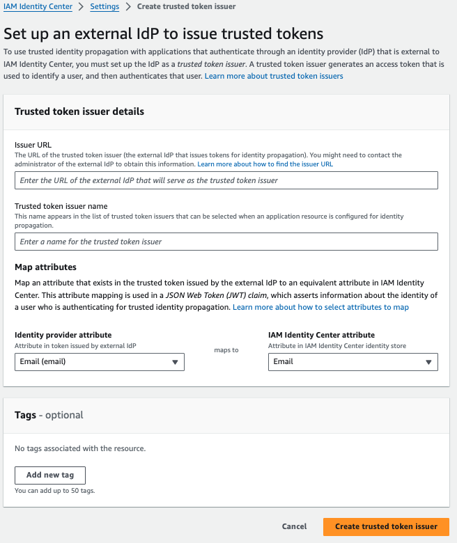
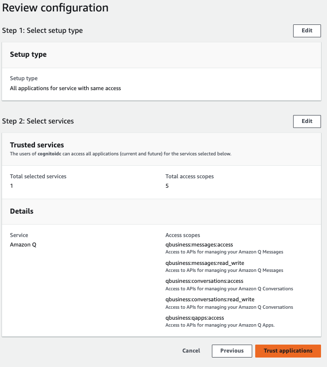

# Custom Web Experience with Amazon Q Business


Customers often want the ability to integrate custom functionalities into the Amazon Q user interface, such as handling feedback, using corporate colors and templates, custom login, and reducing context switching by integrating the user interface into a single platform. The code repo will show how to integrate a custom UI on Amazon Q using **Auth0** for user authentication and Amazon Q SDK to invoke chatbot application programmatically, through [chat_sync API](https://boto3.amazonaws.com/v1/documentation/api/latest/reference/services/qbusiness/client/chat_sync.html).

This repo is a fork of https://github.com/aws-samples/custom-web-experience-with-amazon-q-business/tree/main , which covers in great detail how to configure this with Amazon Cognito.


For detailed instructions, please refer to that [repo](https://github.com/aws-samples/custom-web-experience-with-amazon-q-business/tree/main) and corresponding blog.


👨‍💻 The workflow includes the following steps:
1.	First the user accesses the chatbot application, which is hosted behind an Application Load Balancer.

2.	The user is prompted to log with auth0.

3.  The UI application exchanges the token from auth0 with an IAM Identity Center token with the scope for Amazon Q

4.  The UI applications assumes an IAM role and retrieve an AWS Session from Secure Token Service (STS), augmented with the IAM Identity Center token to interact with Amazon Q
    
5.	Amazon Q uses the ChatSync API to carry out the conversation. Thanks to the identity-aware session, Amazon Q knows which user it is interacting with.


### 🚀 Deploy this Solution:

### Prerequisites: 
Before you deploy this solution, make sure you have the following prerequisites set up:

- A valid AWS account.
- An AWS Identity and Access Management (IAM) role in the account that has sufficient permissions to create the necessary resources.   
- An SSL certificate created and imported into AWS Certificate Manager (ACM).   
For more details, [refer to Importing a certificate](https://docs.aws.amazon.com/acm/latest/userguide/import-certificate-api-cli.html).   
If you do not have a public SSL certificate, follow the steps in the next section to learn how to generate a private certificate.
- An existing, working Amazon Q application. 
- IAM Identity Center, and create few users in Identity Center by configuring their email address and name.
- An existing VPC with at least two subnets.

#### Generate Private certificate

If you already have an SSL certificate, you can skip this section.   
However, if you don't have one and want to proceed with running this demo, you can generate a private certificate associated with a domain using the following openssl command:
```
openssl req \
  -x509 -nodes -days 365 -sha256 \
  -subj '/C=US/ST=Oregon/L=Portland/CN=sampleexample.com' \
  -newkey rsa:2048 -keyout key.pem -out cert.pem

aws acm import-certificate --certificate fileb://cert.pem --private-key fileb://key.pem
```

#### Import Private certificate
The follow the steps outlined in [the documentation](https://docs.aws.amazon.com/acm/latest/userguide/import-certificate-api-cli.html) to import this certificate. Take note of the ARN, as this will be an input for the CloudFormation template.


Please note that you will receive a warning from your browser when accessing the UI if you did not provide a custom SSL certificate when launching the AWS CloudFormation Stack. The above instructions show you how to create a self-signed certificate, which can be used as a backup, but this is certainly not recommended for production use cases.  

You should obtain an SSL Certificate that has been validated by a certificate authority, import it into AWS Certificate Manager, and reference it when launching the AWS CloudFormation Stack.  

If you wish to continue with the self-signed certificate (for development purposes), you should be able to proceed past the browser warning page. With Chrome, you will see a "Your connection is not private" error message (NET::ERR_CERT_AUTHORITY_INVALID), but by clicking on "Advanced," you should then see a link to proceed.


Step 1: Create an IAM Identity Center Application 
---------------------------------------------------------------------

- Navigate to AWS IAM Identity Center, and add a new custom managed application.

  **Select application type** -> then select OAuth2.0 -> Next

  

- Provide an application name and description and select the below option as shown in the  image


-  Now create a trusted token issuer 


- In the Issuer URL  -> provide the ***TrustedIssuerUrl*** from auth0, e.g. **https://dev-u7kq0xxxxnjvk3.us.auth0.com/** and keep the map attributes as Email. And don't miss the trailing / .



- Then navigate back to IAM Identity Center application authentication settings , select the trusted token issuer created in the previous step[refresh it if you don't see in the list] and add the Aud claim -> provide the ***Audience*** from auth0, which is the ClientId, e.g. fudNmDq9J0BLqoxxxxC9IcF0gS42es9 , then click Next

 

- In Specify application credentials ,  Enter IAM roles -> provide any ***RoleArn*** of your choice. We will update this value once we run step 2.

 

 - Then Review all the steps and create the application.

 - Once the application is created, go to the application and -> Assigned users and groups .


 - Then set up the Trusted application for identity propagation , follow the below steps to Amazon Q as Trusted applications for identity propagation





Step 2: Launch the following AWS CloudFormation template to deploy ELB and EC2 instance to host the webapp.
---------------------------------------------------------------------

⚙️ Provide the following parameters for stack

•	**Stack name** – The name of the CloudFormation stack (for example, AmazonQ-UI-Demo)

•	**CertificateARN** – The CertificateARN generated from the previous step

•	**IdcApplicationArn** – Identity Center customer application ARN , keep it blank on first run as we need to create the cognito user pool as part of this stack to create [IAM Identity Center application with a trusted token issuer](https://docs.aws.amazon.com/singlesignon/latest/userguide/using-apps-with-trusted-token-issuer.html)

•	**VPCId** – The ID of the existing VPC that can be used to deploy the demo

•	**PublicSubnetIds** – The ID of the public subnet that can be used to deploy the EC2 instance and the Application Load Balancer

•	**CertificateARN** – The Certificate that needs to be added to the Load Balancer

•	**authClientId** – Auth Client App Id from auth0, e.g. fudNmDq9J0Bxxxx9IcF0gS42es9

•	**authDomain** – Auth Domain from auth0, e.g. dev-u7kq0xxxxxjvk3.us.auth0.com

•	**authAudience** – Auth Audience, same as ClientId from auth0, e.g. fudNmDq9J0Bxxxx9IcF0gS42es9

•	**QApplicationId** – The existing application ID of Amazon Q

•	**IdcApplicationArn** – The AWS Identity Center customer application ARN that we created as part of step 1.


🔗 Once the stack is complete , copy the following Key from the Output tab .
------------------------------------------------

**URL** : The Load balancer URL to access the streamlit app

**RoleArn**: ARN of the IAM role required to setup token exchange in Identity Center.


Step 3: Update role ARN in IdC app
---------------------------------------------------------------------

Navigate back to IAM Identity Center application authentication settings and update the ***RoleArn*** with the RoleArn from step 2.


Step 4: Test streamlit app
---------------------------------------------------------------------

Use the URL from the output tab from step 2, to access the streamlit app in your browser.


Optional: Connect to the EC2 through AWS Session Manager: 
---------------------------------------------------------------------

```
sudo -i
cd /opt/custom-web-experience-with-amazon-q-business
```

## Security

See [CONTRIBUTING](CONTRIBUTING.md#security-issue-notifications) for more information.

## License

This library is licensed under the MIT-0 License. See the LICENSE file.